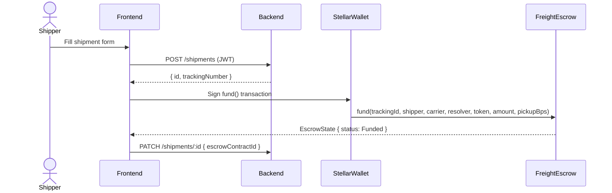
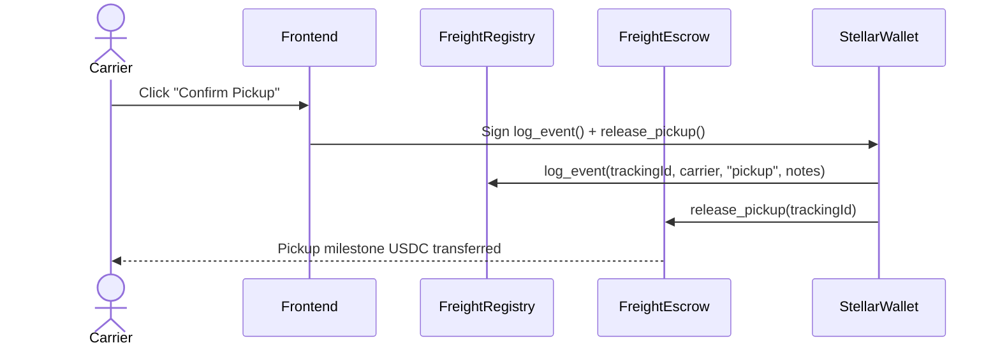
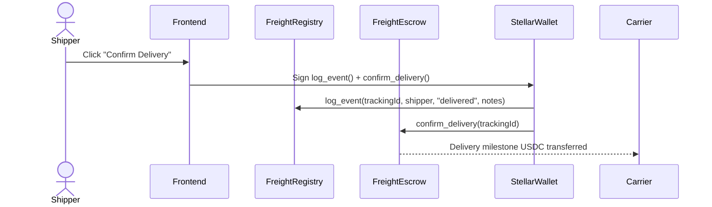
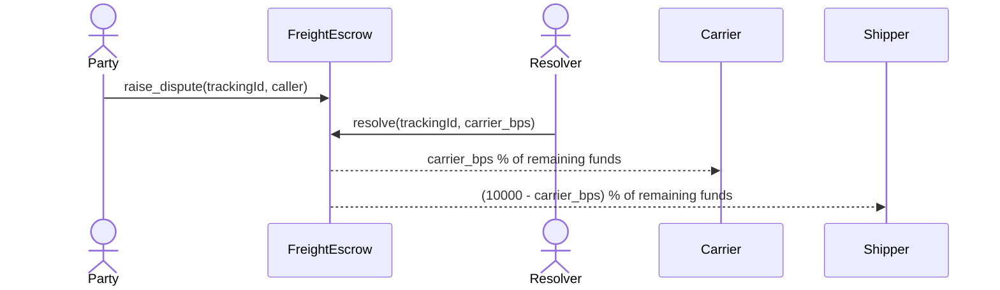

# TransitX — Architecture

## Overview

TransitX is a three-layer application:

```
┌─────────────────────────────────────────────────────────┐
│  Frontend  (Next.js 15 / React 19 / TypeScript)         │
│  Zustand · React Query · React Hook Form · Zod · Axios  │
└────────────────────┬────────────────────────────────────┘
                     │ REST / JSON
┌────────────────────▼────────────────────────────────────┐
│  Backend  (NestJS / TypeORM / PostgreSQL)               │
│  JWT Auth · Shipments · Carriers · Users · Stellar Svc  │
└────────────────────┬────────────────────────────────────┘
                     │ Stellar SDK / Soroban RPC
┌────────────────────▼────────────────────────────────────┐
│  Stellar Network  (Soroban Smart Contracts)             │
│  freight_registry · freight_escrow                      │
└─────────────────────────────────────────────────────────┘
```

Auth and file storage are handled by **Supabase** (Postgres + RLS + Storage).

---

## Key Flows

### 1. Create Shipment & Fund Escrow



### 2. Carrier Pickup



### 3. Delivery Confirmation



### 4. Dispute Resolution



---

## Backend Modules

| Module | Responsibility |
|---|---|
| `AuthModule` | JWT sign-in / sign-up, bcrypt password hashing |
| `UsersModule` | User entity, profile management |
| `ShipmentsModule` | Shipment CRUD, status transitions |
| `CarriersModule` | Carrier registry, ratings |
| `StellarModule` | Horizon queries, address validation |

### Database Schema (PostgreSQL)

```
users
  id uuid PK
  email text UNIQUE
  password_hash text
  full_name text
  stellar_address text
  role text  -- shipper | carrier | broker | admin
  created_at timestamptz

shipments
  id uuid PK
  tracking_number text UNIQUE
  origin text
  destination text
  cargo_description text
  weight_kg decimal
  payment_amount decimal
  payment_currency text DEFAULT 'USDC'
  status text  -- draft | pending_pickup | in_transit | delivered | disputed | cancelled
  escrow_address text
  escrow_contract_id text
  pickup_date date
  shipper_id uuid FK → users
  carrier_id uuid FK → users
  created_at timestamptz
  updated_at timestamptz

carriers
  id uuid PK
  name text UNIQUE
  email text UNIQUE
  phone text
  stellar_address text
  dot_number text
  mc_number text
  rating decimal
  completed_shipments int
  status text  -- active | inactive | suspended
  insurance_policy_number text
  insurance_expiry_date date
  created_at timestamptz
  updated_at timestamptz
```

---

## Smart Contracts

### freight_registry

Append-only event log. Each `ShipmentRecord` holds a `Vec<FreightEvent>`. Events are immutable once written.

**Event types:** `created` · `pickup` · `in_transit` · `delivered` · `disputed`

### freight_escrow

Milestone-based USDC escrow. Pickup milestone (configurable basis points) is released by the carrier; delivery milestone is released by the shipper. A resolver address can adjudicate disputes.

**States:** `Funded → PickupReleased → Delivered` (happy path)  
**Dispute path:** `Funded | PickupReleased → Disputed → Resolved`

---

## Frontend Structure

```
frontend/
├── app/                    # Next.js App Router
│   ├── page.tsx            # Landing
│   ├── dashboard/          # Role-based dashboard
│   ├── shipments/          # List + create
│   ├── shipments/[id]/     # Detail + tracking timeline
│   ├── carriers/           # Carrier directory
│   ├── analytics/          # Charts & KPIs
│   ├── settings/           # Profile + Stellar address
│   └── auth/               # Login, sign-up
├── components/             # Navigation, ShipmentCard, UI primitives
├── hooks/                  # useShipments, useWallet
├── lib/
│   ├── api-client.ts       # Axios instance
│   ├── stellar.ts          # Stellar SDK helpers
│   ├── format.ts           # formatUSDC, truncateAddress
│   └── supabase/           # Browser + server Supabase clients
├── providers/              # QueryProvider, WalletProvider
└── store/                  # Zustand: shipment, wallet
```

---

## Environment Variables

### Frontend

| Variable | Description |
|---|---|
| `NEXT_PUBLIC_SUPABASE_URL` | Supabase project URL |
| `NEXT_PUBLIC_SUPABASE_ANON_KEY` | Supabase anon key |
| `SUPABASE_SERVICE_ROLE_KEY` | Server-only service role key |
| `NEXT_PUBLIC_API_URL` | Backend API base URL |
| `NEXT_PUBLIC_STELLAR_NETWORK` | `testnet` or `mainnet` |
| `NEXT_PUBLIC_TRANSITX_PLATFORM_ADDRESS` | Platform Stellar address |
| `NEXT_PUBLIC_REGISTRY_CONTRACT_ID` | freight_registry contract ID |
| `NEXT_PUBLIC_ESCROW_CONTRACT_ID` | freight_escrow contract ID |

### Backend

| Variable | Description |
|---|---|
| `DATABASE_URL` | PostgreSQL connection string |
| `JWT_SECRET` | JWT signing secret (min 32 chars) |
| `STELLAR_NETWORK` | `testnet` or `mainnet` |
| `STELLAR_SECRET_KEY` | Platform Stellar secret key |
| `SUPABASE_URL` | Supabase project URL |
| `SUPABASE_SERVICE_ROLE_KEY` | Supabase service role key |
